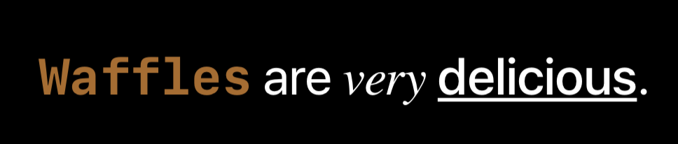
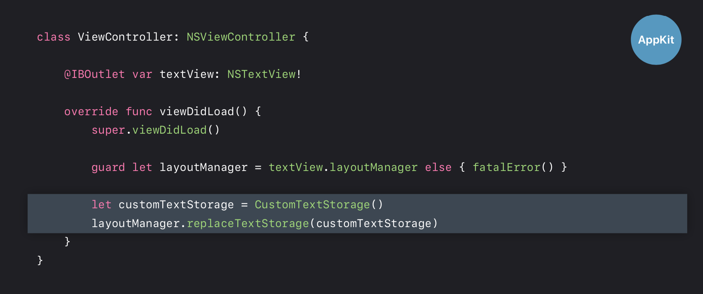
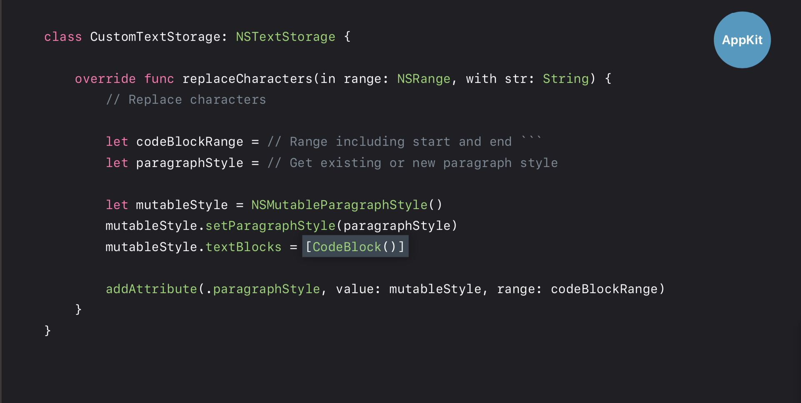
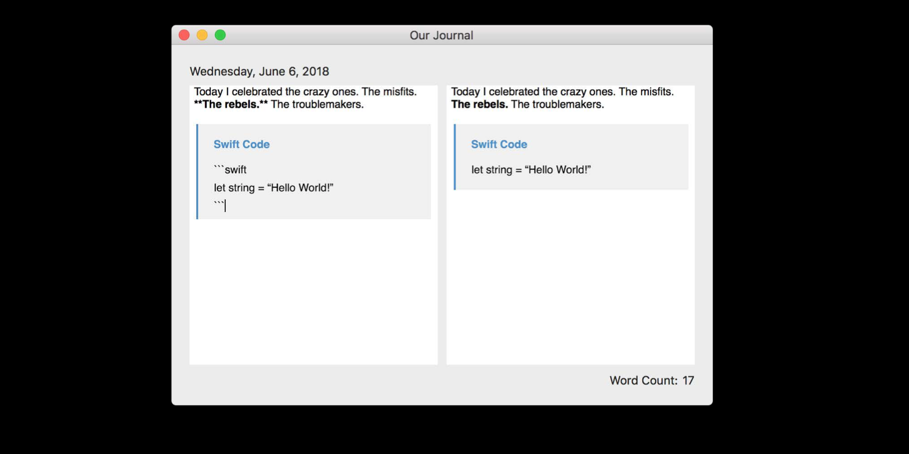
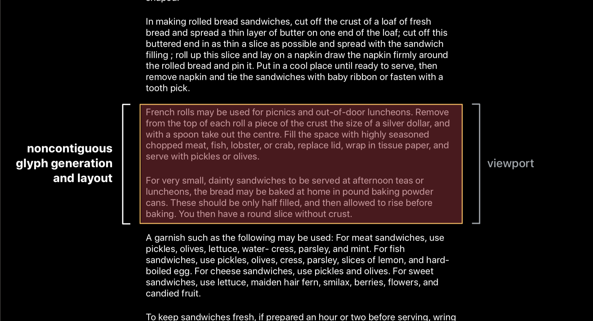

链接：[2018 session 221](https://developer.apple.com/videos/play/wwdc2018/221/)

## 层级

## 如何选择

## 复杂文本定制方案

类似于 MVC 的架构模式：

###### 1. Storage

1. NSTextStorage：存储 字符串数据和属性信息
 
 	
	
2. NSContainer：定义文本布局的几何区域

	
	
详情：

 * wwdc12 `Introduction to Attributed Strings for iOS`
 * wwdc12 `Advanced Attributed Strings for iOS`

 
###### 2. Display
 
 
 
 更多：
 
 * Text Programming Guide for iOS
 * Text System User Interface Layer Programming Guide
 
###### 3. Layout
 
 
 
NSLayoutManager: 协调 Storage 和 Display，控制布局流程，**负责字形生成和字形布局**。

更多：wwdc13:`Advanced Layouts and Effects With Text Kit`
 
 
## 配置方案

1. 标准方案：

	
	
2. 相同布局，不同展示方案：

	

3. 不同布局方案：

	
	
	
更多：wwdc2010 `Advanced Cocoa Text Tips and Tricks`

## 定制化方案

代理--通知--子类化。定制程度依次增强。

###### 1. 顶部 UILable 示例

实现方案：

###### 2. 多行可选 UITextView 示例：

## Markdown 解析文本框

1. 简单字数统计：使用 通知 方案

	
	
	
2. markdown 加粗：代理 方案

	
	
	
3. markdown 代码引用： 子类化

	
	
	
	
	

## Markdown 左右视图展现方案：

1. 实现方案：

	

2. UI 组织：

	

3. 代理方案清除 markdown 字符：

	
	
	

更多：

* Text Programming Guide for iOS
* Cocoa Text Architecture Guide
* Introduction to Text Layout Programming Guide

	
## 正确设置

###### 1. 关于默认属性问题

一段字符串默认为 Helvetica 12，则错误示例：

1. 解决方案一：避免混合使用纯文本和属性文本：
	
	
	
2. 以纯文本创建特定默认属性文本：

	
	

###### 2. 段落问题

1. 应用段落属性忽略最后一个文字（但错误结果如右下角，原因同上，默认值问题）：

	

###### 3. 非连续布局

* 布局策略时机：

	
	
* 连续布局问题：

	

* 非连续布局优势：

	
	
	
1. 在 `UITextView` 中设置非连续布局（默认值）：
	
	``(layout manager)allowsNonContiguousLayout``
	
2. 在非连续布局下，避免一次性执行全文本布局请求

	
	
更多：wwdc2017 Efficient Interactions with Frameworks

## 安全

深层防护（综合防护）

1. 文本输入限制（如长度）

